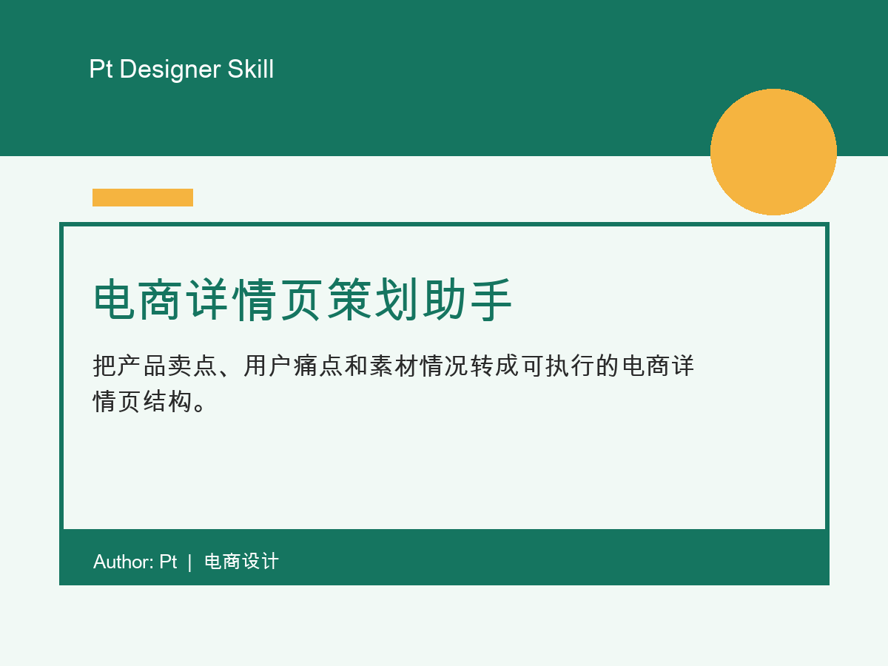

# 电商详情页策划助手

把产品卖点、用户痛点和素材情况转成可执行的电商详情页结构。

## 适合谁

电商设计师、运营设计师、店铺美工、产品营销人员

## 适用场景

当你要做电商详情页，但产品资料很散、卖点很多、不知道页面怎么排时使用。

## 输入

产品名称、品类、价格带、目标用户、核心卖点、用户痛点、竞品差异、证明材料、必须展示的参数、素材现状、平台、目标动作

## 输出

页面策略、模块结构、首屏方案、视觉节奏建议、素材补拍清单、合规提醒

## 在线演示

https://2077zpt-source.github.io/pt-zcool-ecommerce-detail-page-planner/

## 文件

- `SKILL.md`: skill 主体文件
- `demo.html`: 说明演示页
- `assets/cover.png`: 4:3 展示封面
- `LICENSE`: MIT License

## 作者

Author: Pt  
License: MIT
